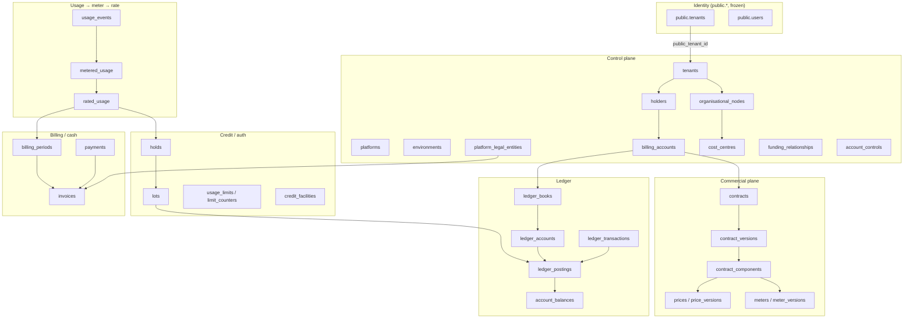

# Deliverable A — `fin.*` Entity Model

**Stage:** 0 (§128)
**Owner:** Agent A
**Date:** 2026-08-18
**Status:** **APPROVED** for downstream Stage 0 B–H work (QA R1 verification, 2026-08-18). Implementation still waits on all eight deliverables.
**Revision:** R1 approved; R2 nits captured as DL-025…DL-028 (no new tables)
**Depends on:** `docs/audit/BILLING_SPEC_AUDIT_2026-08.md` §3–§101, `docs/design/BILLING_ENTERPRISE_REBUILD_PLAN.md` Stage 0/1, `docs/audit/PRE_REBUILD_AUDIT_2026-08-17.md`
**Locks:** `DECISION_LOG.md` DL-001 … DL-028

This is the vocabulary for deliverables B–H. If a later deliverable needs a column this file omitted, append a Decision Log row — do not invent a parallel table.

---

## 1. Conventions (apply to every table unless the table's mutability class overrides)

| Rule | Value |
|---|---|
| Schema | `fin` |
| PK | `id UUID PRIMARY KEY` (insert-time `gen_random_uuid()`; Stage 1 may adopt UUIDv7) |
| Cross-schema identity | `public_tenant_id TEXT`, `public_user_id TEXT`, `public_agency_id TEXT` — never implicit cast |
| Environment | `environment TEXT NOT NULL CHECK (environment IN ('LIVE','TEST'))` on every economic / tenant-scoped table |
| Units | Credit / lot / hold / limit / meter quantities: `BIGINT` atomic units, `UNIT_SCALE = 1_000_000`. Money: `BIGINT` ISO-4217 minor (`*_minor`). Rates / VAT: `INTEGER` basis points (`*_bps`). **No** `FLOAT`/`REAL`/`DOUBLE`/`NUMERIC` on a value path |
| Time | `TIMESTAMPTZ`. Application time comes from `BusinessClock.now()` (spec §68) — columns store the clock's value, never `DEFAULT CURRENT_TIMESTAMP` on economic effect columns |
| Actor | Financial mutations stamp `actor_type` (`USER` / `SYSTEM` / `WORKER` / `PSP` / `RECONCILIATION`) + `actor_id` + `reason_code` |
| Optimistic concurrency | Mutable tables: `version BIGINT NOT NULL DEFAULT 1` + BEFORE UPDATE trigger. Append-only tables: no `version`, no UPDATE |
| Soft vs hard delete | Economic rows are never hard-deleted. Control-plane rows (draft prices, draft contracts) may be `superseded_at` |
| JSONB | Allowed only for documented free-form payloads (`explanation`, `filter_definition`, `usage_events.dimensions`, `metadata`). Anything filtered, joined, rated, or reported is a real column (audit C-3). **Forbidden** as a rating surface: no `tiers`, no `dimensional_selector` — those are `fin.price_tiers` / `fin.price_dimensions` (M7) |
| `data` JSONB catch-all | **Forbidden** on `fin.*`. That is the DAL anti-pattern this rebuild retires |

### 1.1 Mutability classes

| Class | UPDATE | DELETE | `version` | Examples |
|---|---|---|---|---|
| **MUTABLE** | yes, with `If-Match` | no (status / `superseded_at`) | yes | `tenants`, `contracts` (header), `prices` (header), `credit_facilities` |
| **VERSIONED** | header yes; version rows no | no | header only | `contract_versions`, `price_versions`, `meter_versions`, `vendor_rate_versions` |
| **APPEND_ONLY** | **REVOKE UPDATE, DELETE** from app role | no | no | `usage_events`, `ledger_postings`, `ledger_transactions`, `rated_usage`, `lot_allocations`, `financial_audit_events`, `accounting_events`, invoice lines after ISSUE, vendor statement lines after FINALIZE |
| **CACHE** | yes, only via posting trigger | no | no (uses `last_posting_id`) | `account_balances`, `limit_counters`, `unapplied_cash` |
| **INTENT** | status-machine only | no | yes | `holds`, `purchase_intents`, `approval_requests`, `dunning_cases`, `idempotency_keys`, `outbox_events`, `accounting_periods`, `disputes` |

App-role GRANT default: `SELECT, INSERT` on APPEND_ONLY; `SELECT, INSERT, UPDATE` on MUTABLE / INTENT / CACHE. Never `DELETE` on economic tables. Agent D specifies RLS + REVOKE in `H_SECURITY.md`.

### 1.2 Shared column packs (referenced below as `+pack`)

**`+env`** — `environment TEXT NOT NULL CHECK (environment IN ('LIVE','TEST'))`

**`+audit`** — `created_at TIMESTAMPTZ NOT NULL`, `created_by_actor_type TEXT`, `created_by_actor_id UUID`, `updated_at TIMESTAMPTZ NOT NULL`, `updated_by_actor_type TEXT`, `updated_by_actor_id UUID`

**`+occ`** — `version BIGINT NOT NULL DEFAULT 1`

**`+tenant`** — `tenant_id UUID NOT NULL REFERENCES fin.tenants(id)`

---

## 2. Relationship overview



Traversal the spec §130 requires, and this model must support without joins into `commercial.*`:

1. Invoice → line → adjustment → `rated_usage` → `contract_version` → `price_version` → `meter_version` → `usage_events` → `(source_system, source_event_id)`
2. `rated_usage` → `authorization_attempts` / `holds` → lots → `ledger_transactions` → postings → `account_balances`
3. Lot → `purchase_intents` / grant / facility → `accounting_events`
4. `usage_events` → `vendor_usage_events` → statement line → actual cost → margin

---

## 3. Control-plane entities

### 3.1 `fin.platforms` — MUTABLE

One row per deployed Wingcaster control plane (today: a single SaaS platform).

| Column | Type | Notes |
|---|---|---|
| id | UUID PK | |
| code | TEXT UNIQUE NOT NULL | `wingcaster` |
| name | TEXT NOT NULL | |
| +audit +occ | | |

### 3.2 `fin.environments` — MUTABLE

Physical TEST/LIVE isolation is a **row**, not a UI toggle (spec §113).

| Column | Type | Notes |
|---|---|---|
| id | UUID PK | |
| platform_id | UUID NOT NULL → platforms | |
| code | TEXT NOT NULL | `LIVE` / `TEST` |
| clock_mode | TEXT NOT NULL | `WALL` / `INJECTED` — TEST may inject `BusinessClock` |
| UNIQUE(platform_id, code) | | |

Economic tables store `environment` as the code (denormalised, check-constrained) so partition/RLS predicates stay simple. This table is the registry + clock policy.

### 3.3 `fin.platform_legal_entities` — MUTABLE

Seller of record. Invoice sequences, tax, and residency hang here — **not** on the tenant (spec §3.3).

| Column | Type | Notes |
|---|---|---|
| id | UUID PK | |
| platform_id | UUID NOT NULL → platforms | |
| code | TEXT NOT NULL | `WC-UAE`, `WC-KSA`, `WC-US` |
| legal_name | TEXT NOT NULL | |
| jurisdiction | CHAR(2) NOT NULL | ISO 3166-1 |
| tax_id | TEXT | VAT / TIN |
| billing_currency | CHAR(3) NOT NULL | ISO 4217 |
| residency_key | TEXT NOT NULL | **data-residency / cell / partition key** (DL-013). This is what `usage_events.residency_key` references. Distinct from billing residency (`seller_legal_entity_id` on contracts / invoices) |
| +audit +occ | | |
| UNIQUE(platform_id, code) | | |

### 3.4 `fin.tenants` — MUTABLE

Billing projection of `public.tenants`. **Not** `agents.id`. Today's `req.user.id`-as-tenantId is a documented collapse (audit §3.4, handover §2.2).

| Column | Type | Notes |
|---|---|---|
| id | UUID PK | |
| +env | | |
| public_tenant_id | TEXT NOT NULL UNIQUE | → `public.tenants(id)` |
| platform_id | UUID NOT NULL → platforms | |
| default_legal_entity_id | UUID → platform_legal_entities | seller default |
| default_residency_key | TEXT NOT NULL | |
| status | TEXT NOT NULL | `ACTIVE` / `READ_ONLY` / `SUSPENDED` / `CLOSED` — **access** only; financial restrictions live on `account_controls` (DL / spec §60, §129) |
| +audit +occ | | |
| UNIQUE(environment, public_tenant_id) | | |

### 3.5 `fin.holders` — MUTABLE

The economic subject that **owns balances** (spec §3.5). A personal tenant has one holder; an agency tenant has one or more (agency + optional desk / team holders).

| Column | Type | Notes |
|---|---|---|
| id | UUID PK | |
| +env +tenant | | |
| holder_kind | TEXT NOT NULL | `TENANT_ROOT` / `ORGANISATIONAL_NODE` / `BILLING_ACCOUNT` |
| display_name | TEXT NOT NULL | |
| parent_holder_id | UUID → holders | org tree; nullable at root |
| +audit +occ | | |
| CHECK environment matches tenant | trigger | |

### 3.6 `fin.billing_accounts` — MUTABLE

Who is billed (spec §3.6). Distinct from holder (who consumes) and tenant (who isolates).

| Column | Type | Notes |
|---|---|---|
| id | UUID PK | |
| +env +tenant | | |
| holder_id | UUID NOT NULL → holders | default paying holder |
| seller_legal_entity_id | UUID NOT NULL → platform_legal_entities | |
| billing_currency | CHAR(3) NOT NULL | |
| billing_timezone | TEXT NOT NULL | IANA |
| invoice_delivery | TEXT NOT NULL | `EMAIL` / `PORTAL` / `BOTH` |
| +audit +occ | | |

### 3.7 `fin.organisational_nodes` — MUTABLE

Org tree (spec §61). **Not** the funding tree.

| Column | Type | Notes |
|---|---|---|
| id | UUID PK | |
| +env +tenant | | |
| holder_id | UUID NOT NULL → holders | |
| parent_node_id | UUID → organisational_nodes | |
| cost_centre_id | UUID → cost_centres | |
| name | TEXT NOT NULL | |
| +audit +occ | | |

### 3.8 `fin.cost_centres` — MUTABLE

| Column | Type | Notes |
|---|---|---|
| id | UUID PK | |
| +env +tenant | | |
| code | TEXT NOT NULL | |
| name | TEXT NOT NULL | |
| UNIQUE(tenant_id, environment, code) | | |
| +audit +occ | | |

### 3.9 `fin.funding_relationships` — MUTABLE — companion (§61–63)

Edges used by the funding resolver. Org parentage must not be reused as a funding path.

| Column | Type | Notes |
|---|---|---|
| id | UUID PK | |
| +env +tenant | | |
| from_holder_id | UUID NOT NULL → holders | payer / parent wallet |
| to_holder_id | UUID NOT NULL → holders | beneficiary |
| relationship_kind | TEXT NOT NULL | `PAYS_FOR` / `MAY_DRAW` / `MAY_ESCALATE` |
| priority | INTEGER NOT NULL | resolver order |
| +audit +occ | | |
| UNIQUE(environment, from_holder_id, to_holder_id, relationship_kind) | | |

### 3.10 `fin.account_controls` — MUTABLE — companion (§60)

Separate flags so one `status` cannot hide materially different restrictions (spec §129).

| Column | Type | Notes |
|---|---|---|
| id | UUID PK | |
| +env | | |
| subject_type | TEXT NOT NULL | `TENANT` / `HOLDER` / `BILLING_ACCOUNT` / `CONTRACT` |
| subject_id | UUID NOT NULL | |
| allow_prepaid_usage | BOOLEAN NOT NULL | |
| allow_postpaid_usage | BOOLEAN NOT NULL | |
| allow_purchases | BOOLEAN NOT NULL | |
| allow_transfers | BOOLEAN NOT NULL | |
| allow_refunds | BOOLEAN NOT NULL | |
| allow_grants | BOOLEAN NOT NULL | |
| reason_code | TEXT NOT NULL | |
| +audit +occ | | |
| UNIQUE(environment, subject_type, subject_id) | | |

---

## 4. Ledger (smallest conservation boundary)

### 4.1 `fin.ledger_books` — MUTABLE

Spec §3.9 / §29. One book is the conservation boundary (I-02, I-03).

| Column | Type | Notes |
|---|---|---|
| id | UUID PK | |
| +env +tenant | | |
| billing_account_id | UUID NOT NULL → billing_accounts | |
| book_type | TEXT NOT NULL | `CUSTOMER` / `RESELLER` / `PLATFORM` / `CLEARING` / `PROMOTIONAL` |
| currency | CHAR(3) NOT NULL | book is single-currency |
| +audit +occ | | |
| UNIQUE(environment, billing_account_id, book_type) | | |

### 4.2 `fin.ledger_accounts` — MUTABLE

Seven types (spec §29).

| Column | Type | Notes |
|---|---|---|
| id | UUID PK | |
| +env | | |
| book_id | UUID NOT NULL → ledger_books | |
| account_type | TEXT NOT NULL | `AVAILABLE` / `HELD` / `ISSUANCE` / `CONSUMED` / `EXPIRED` / `ADJUSTMENT` / `CLEARING` — **seven types, no eighth.** FX rounding residual posts to `ADJUSTMENT` with `reason_code = 'FX_ROUNDING'` (DL-015) |
| UNIQUE(book_id, account_type) | | one of each type per book |
| +audit +occ | | |

### 4.3 `fin.ledger_transactions` — APPEND_ONLY

Header. The **only** legal way to create postings is one transaction + N postings in a single DB transaction (spec §30, Stage 1 `ledger/transactions.js`).

| Column | Type | Notes |
|---|---|---|
| id | UUID PK | |
| +env | | |
| book_id | UUID NOT NULL → ledger_books | **this tx's only book.** Cross-book value movement is two txs sharing `pair_id` (M8 / DL-012) |
| pair_id | UUID | set on **both** legs of a `TRANSFER`; NULL otherwise. Agent C locks both books by `pair_id`. Integrity: DL-025 |
| fx_rate_snapshot_id | UUID → fx_rate_snapshots | required on a cross-currency pair-leg. Mechanism: DL-026 (Agent C trigger) |
| shape | TEXT NOT NULL | `FUNDING` / `HOLD` / `VOID` / `CAPTURE` / `DIRECT_SPEND` / `EXPIRY` / `REFUND` / `ADJUSTMENT` / `TRANSFER` / `GRANT` / `MIGRATE` |
| economic_source_type | TEXT NOT NULL | `HOLD` / `LOT` / `PURCHASE_INTENT` / `RATED_USAGE` / `MANUAL` / `RECONCILIATION` / `INVOICE` / `FACILITY` / `REFUND` / `TRANSFER_INTENT` |
| economic_source_id | UUID NOT NULL | |
| actor_type / actor_id | TEXT / UUID | I-15 |
| reason_code | TEXT NOT NULL | `FX_ROUNDING` reserved for residual ADJUSTMENT postings |
| idempotency_key_id | UUID → idempotency_keys | |
| created_at | TIMESTAMPTZ NOT NULL | clock |

**Uniqueness (DL-014 / A-Q3 closed — Agent C does not invent a column):**

```sql
CREATE UNIQUE INDEX uq_ledger_tx_once_per_source_shape
  ON fin.ledger_transactions (environment, economic_source_type, economic_source_id, shape)
  WHERE shape IN (
    'FUNDING','HOLD','VOID','CAPTURE','DIRECT_SPEND',
    'EXPIRY','GRANT','MIGRATE'
  );
```

| shape | unique per source? | economic_source_type | Replay |
|---|---|---|---|
| FUNDING | yes | `PURCHASE_INTENT` | replay via idempotency_keys |
| HOLD | yes | `HOLD` (authorize) | same |
| VOID | yes | `HOLD` | same |
| CAPTURE | yes | `HOLD` | same |
| DIRECT_SPEND | yes | `RATED_USAGE` | same |
| EXPIRY | yes | `LOT` | same |
| GRANT | yes | `APPROVAL_REQUEST` or grant id | same |
| MIGRATE | yes | `LOT` | same |
| TRANSFER | yes, per book | `TRANSFER_INTENT` | one `pair_id`, two txs; unique is `(environment, economic_source_id, book_id)` |
| REFUND | no (partials) | `REFUND` | multiple; uniqueness is `idempotency_keys` only |
| ADJUSTMENT | no | `MANUAL` / `RECONCILIATION` / `INVOICE` | multiple; uniqueness is `idempotency_keys` only |

`TRANSFER` is therefore **not** in the partial unique above. Use instead:

```sql
CREATE UNIQUE INDEX uq_ledger_tx_transfer_per_book
  ON fin.ledger_transactions (environment, economic_source_id, book_id)
  WHERE shape = 'TRANSFER';

-- R2-1 / DL-025 — pair integrity (no 3-leg pair; pair only on TRANSFER)
ALTER TABLE fin.ledger_transactions
  ADD CONSTRAINT chk_pair_id_transfer_only
  CHECK (pair_id IS NULL OR shape = 'TRANSFER');

CREATE UNIQUE INDEX uq_ledger_tx_pair_book
  ON fin.ledger_transactions (pair_id, book_id)
  WHERE pair_id IS NOT NULL;
```

**R2-1 deferred assertion (Agent C transaction matrix, not a new column):** at COMMIT of a command that writes `pair_id`, exactly two `ledger_transactions` rows share that `pair_id`. A 1-leg or 3-leg pair is a conservation bug.

**R2-2 FX stamp (Agent C, DL-026):** prose on `fx_rate_snapshot_id` is not enough. Agent C names and ships this check (constraint or BEFORE INSERT trigger; a CHECK cannot join `ledger_books` for `same_currency`):

```
fx_rate_snapshot_id IS NOT NULL
  OR pair_id IS NULL
  OR counterpart_book.currency = this.book.currency
```

Test §18 #10 asserts the behaviour; Agent C owns the mechanism and references DL-026.

Deferred constraint (I-01): `SUM(postings.amount_units) = 0` **per transaction**, checked at COMMIT. Paired txs each conserve independently; FX residual is an `ADJUSTMENT` posting on the destination tx (`reason_code = 'FX_ROUNDING'`), still inside that tx's zero-sum.

### 4.4 `fin.ledger_postings` — APPEND_ONLY

| Column | Type | Notes |
|---|---|---|
| id | UUID PK | |
| +env | | |
| transaction_id | UUID NOT NULL → ledger_transactions | |
| book_id | UUID NOT NULL → ledger_books | **MUST equal `ledger_transactions.book_id`.** No exceptions (M8 / DL-012) |
| account_id | UUID NOT NULL → ledger_accounts | `account.book_id` must equal `posting.book_id` (I-02) |
| amount_units | BIGINT NOT NULL | signed; never 0. Book currency / atomic units |
| fx_rate_snapshot_id | UUID → fx_rate_snapshots | required iff the parent tx has one (cross-currency pair-leg) |
| lot_id | UUID → lots | when the posting draws / restores a lot |
| created_at | TIMESTAMPTZ NOT NULL | |
| CHECK (amount_units <> 0) | | |

**Cross-book rule (DL-012) — pick one, the other clause is deleted:**

- Every posting is same-book as its transaction. I-02 trigger: `posting.book_id = tx.book_id AND account.book_id = posting.book_id`.
- Cross-book movement = **paired transactions** sharing `pair_id` (one tx per book). Each book has its own `CLEARING` **account** (the seventh `account_type`), not a posting that jumps books.
- A `CLEARING` posting still lives in its own book. There is no "CLEARING leg that may reference the other book."

A posting whose `book_id ≠ tx.book_id` is a conservation bug, not a feature.

### 4.5 `fin.account_balances` — CACHE

| Column | Type | Notes |
|---|---|---|
| account_id | UUID PK → ledger_accounts | |
| +env | | |
| balance_units | BIGINT NOT NULL | |
| last_posting_id | UUID NOT NULL → ledger_postings | |
| updated_at | TIMESTAMPTZ NOT NULL | |

Writers: posting trigger only. Readers: cache is advisory; invariant R00x recomputes `SUM(postings)`.

---

## 5. Lots, holds, limits

### 5.1 `fin.lots` — MUTABLE (remaining_units only via allocations)

Ten `source_kind` values (spec §35). Paid vs bonus are **separate lots** (`consideration_minor = 0` ⇒ bonus, spec §51).

| Column | Type | Notes |
|---|---|---|
| id | UUID PK | |
| +env +tenant | | |
| book_id | UUID NOT NULL → ledger_books | |
| billing_account_id | UUID NOT NULL → billing_accounts | |
| holder_id | UUID NOT NULL → holders | |
| contract_id | UUID → contracts | |
| source_kind | TEXT NOT NULL | `PURCHASE` / `SUBSCRIPTION_GRANT` / `PROMOTIONAL_GRANT` / `ROLLOVER` / `TRANSFER_IN` / `ADJUSTMENT` / `REFUND_REVERSAL` / `FACILITY_DRAW` / `MIGRATION` / `COMPENSATION` |
| granted_units | BIGINT NOT NULL | |
| remaining_units | BIGINT NOT NULL | mutated only by `lot_allocations` |
| consideration_minor | BIGINT NOT NULL | 0 = bonus |
| currency | CHAR(3) NOT NULL | |
| draw_priority | INTEGER NOT NULL | spec §39 ASC |
| issued_at / expires_at | TIMESTAMPTZ | expires_at nullable |
| status | TEXT NOT NULL | `ACTIVE` / `EXHAUSTED` / `EXPIRED` / `FROZEN` — Agent B owns transitions |
| purchase_intent_id | UUID → purchase_intents | |
| +audit +occ | | |
| CHECK (remaining_units >= 0 AND remaining_units <= granted_units) | | |

### 5.2 `fin.lot_applicability_rules` — MUTABLE

| Column | Type | Notes |
|---|---|---|
| id | UUID PK | |
| lot_id | UUID NOT NULL → lots | |
| +env | | |
| rule_kind | TEXT NOT NULL | `ALLOW_METER` / `DENY_METER` / `ALLOW_CATEGORY` / `DENY_CATEGORY` / `ALLOW_VENDOR` / `DENY_VENDOR` / `ALLOW_ACTION` / `DENY_ACTION` |
| matcher | TEXT NOT NULL | meter_id / category / action_key / vendor_id |
| +audit +occ | | |

### 5.3 `fin.lot_allocations` — APPEND_ONLY

| Column | Type | Notes |
|---|---|---|
| id | UUID PK | |
| +env | | |
| lot_id | UUID NOT NULL → lots | |
| posting_id | UUID NOT NULL → ledger_postings | |
| hold_id | UUID → holds | |
| units | BIGINT NOT NULL | signed: draw negative-on-lot / restore positive |
| created_at | TIMESTAMPTZ NOT NULL | |
| UNIQUE(posting_id, lot_id) | | |

`remaining_units` on the lot is `granted_units + SUM(units)` (draws stored negative). Trigger maintains the cache; R007 recomputes.

### 5.4 `fin.holds` — INTENT (spec §40–44)

| Column | Type | Notes |
|---|---|---|
| id | UUID PK | |
| +env +tenant | | |
| holder_id / billing_account_id / book_id | UUID NOT NULL | |
| subject_type / subject_id | TEXT / UUID | rated usage, invoice line, purchase, … |
| units | BIGINT NOT NULL | |
| status | TEXT NOT NULL | `OPEN` / `CAPTURED` / `VOIDED` / `EXPIRED` |
| authorize_tx_id | UUID → ledger_transactions | |
| capture_tx_id | UUID → ledger_transactions | |
| release_tx_id | UUID → ledger_transactions | void or expiry |
| expires_at | TIMESTAMPTZ NOT NULL | |
| +audit +occ | | |

### 5.5 `fin.usage_limits` — MUTABLE (spec §45)

| Column | Type | Notes |
|---|---|---|
| id | UUID PK | |
| +env +tenant | | |
| contract_component_id | UUID → contract_components | |
| meter_id | UUID → meters | |
| period_kind | TEXT NOT NULL | `DAY` / `WEEK` / `MONTH` / `ROLLING_30D` / `CONTRACT_TERM` |
| limit_units | BIGINT NOT NULL | |
| breach_behavior | TEXT NOT NULL | `BLOCK` / `WARN` |
| +audit +occ | | |

### 5.6 `fin.limit_counters` — CACHE (spec §46)

| Column | Type | Notes |
|---|---|---|
| id | UUID PK | |
| usage_limit_id | UUID NOT NULL → usage_limits | |
| +env | | |
| period_key | TEXT NOT NULL | deterministic; e.g. `2026-08` / `2026-08-18` / `R30:2026-08-18` |
| consumed_units | BIGINT NOT NULL | |
| UNIQUE(usage_limit_id, period_key) | | |

---

## 6. Usage, meters, rating

### 6.1 `fin.usage_events` — APPEND_ONLY, LIST-partitioned by `residency_key`

Facts only (DL-007). Carries the 42P10 + swallow lessons (audit A/B-1, A-2, A §2).

| Column | Type | Notes |
|---|---|---|
| id | UUID | PK is `(id, residency_key)` |
| +env | | |
| residency_key | TEXT NOT NULL | cell / territory; `__platform__` default |
| tenant_id | UUID → tenants | nullable only for pre-attribution ingress; must be filled before metering |
| holder_id / billing_account_id | UUID | nullable until resolved |
| source_system | TEXT NOT NULL | `orchestrator` / `listings` / `wa_listings` / `webhooks` / `google` / `backfill_v1` / … |
| source_event_id | TEXT NOT NULL | permanent; never recycled |
| event_type | TEXT NOT NULL | registered schema key (`message.out.whatsapp.utility`, …) |
| event_kind | TEXT NOT NULL | `ORIGINAL` / `CORRECTION` / `CANCELLATION` / `REPLACEMENT` |
| corrects_event_id | UUID | required when kind ≠ ORIGINAL |
| corrects_residency_key | TEXT | required when kind ≠ ORIGINAL; **same cell as the corrected row** |
| subject_type / subject_id | TEXT / TEXT | listing, conversation, distribution, … |
| quantity_units | BIGINT NOT NULL | raw measured quantity in atomic units (or count * UNIT_SCALE) |
| dimensions | JSONB NOT NULL DEFAULT '{}' | channel, destination_country, whatsapp_category, … |
| occurred_at / received_at | TIMESTAMPTZ NOT NULL | |
| ingestion_version | INTEGER NOT NULL | |
| created_at | TIMESTAMPTZ NOT NULL | |
| **absent** | | no `price_minor`, no `casts_charged`, no `rate_card_version` |

Constraints / indexes:

- `PRIMARY KEY (id, residency_key)`
- `UNIQUE (environment, source_system, source_event_id, residency_key)` — permanent economic dedup (spec §91). `ON CONFLICT DO NOTHING`.
- `FOREIGN KEY (corrects_event_id, corrects_residency_key) REFERENCES fin.usage_events (id, residency_key)` — **composite, explicit (M1)**. A UUID-only FK is not valid against this PK and is the 42P10 class of drift.
- `CHECK ((event_kind = 'ORIGINAL' AND corrects_event_id IS NULL AND corrects_residency_key IS NULL) OR (event_kind <> 'ORIGINAL' AND corrects_event_id IS NOT NULL AND corrects_residency_key IS NOT NULL))`
- `INDEX (tenant_id, occurred_at DESC)`
- `INDEX (event_type, occurred_at DESC)`
- `INDEX (corrects_event_id, corrects_residency_key)`
- `residency_key` **is** `platform_legal_entities.residency_key` (DL-013). Default partition `__platform__`. Creating a legal entity **must** create the matching LIST partition (advisory; partition DDL cannot always share the row tx — Agent C documents the race).

### 6.2 `fin.usage_events_dlq` — MUTABLE — companion (audit A-2)

Unpartitioned. Same fact columns plus:

| Column | Type | Notes |
|---|---|---|
| error_code | TEXT NOT NULL | `PARTITION_MISSING` / `DB_ERROR` / `SCHEMA_INVALID` / `ENV_MISMATCH` / … |
| error_message | TEXT NOT NULL | |
| attempts | INTEGER NOT NULL | |
| last_attempt_at | TIMESTAMPTZ | |
| next_retry_at | TIMESTAMPTZ | |
| dead_lettered_at | TIMESTAMPTZ | |

Metric: `wingcaster_usage_event_emit_total{result="ok\|drop\|dlq"}`. Alarm on drop-rate > 0 for non-`webhook.received`.

### 6.3 `fin.meters` — MUTABLE header

| Column | Type | Notes |
|---|---|---|
| id | UUID PK | |
| +env | | |
| code | TEXT NOT NULL | `wa.outbound.utility`, `listing.active_day`, … |
| name | TEXT NOT NULL | |
| UNIQUE(environment, code) | | |
| +audit +occ | | |

### 6.4 `fin.meter_versions` — VERSIONED / APPEND_ONLY rows

| Column | Type | Notes |
|---|---|---|
| id | UUID PK | |
| meter_id | UUID NOT NULL → meters | |
| +env | | |
| version_n | INTEGER NOT NULL | |
| aggregation_type | TEXT NOT NULL | `COUNT` / `SUM` / `MAX` / `UNIQUE_COUNT` / `LATEST` / `TIME_WEIGHTED` |
| filter_definition | JSONB NOT NULL | declarative DSL (spec §9) |
| effective_from / effective_to | TIMESTAMPTZ | to nullable = open |
| UNIQUE(meter_id, version_n) | | |
| EXCLUDE USING gist (meter_id WITH =, tstzrange(effective_from, COALESCE(effective_to, 'infinity'::timestamptz)) WITH &&) | | T9 — same shape as contract/price/vendor rate versions |

### 6.5 `fin.metered_usage` — APPEND_ONLY (supersede via new row)

| Column | Type | Notes |
|---|---|---|
| id | UUID PK | |
| +env +tenant | | |
| meter_version_id | UUID NOT NULL → meter_versions | |
| holder_id | UUID NOT NULL → holders | |
| period_key | TEXT NOT NULL | |
| quantity_units | BIGINT NOT NULL | |
| computation_hash | TEXT NOT NULL | spec §10 |
| supersedes_id | UUID → metered_usage | |
| status | TEXT NOT NULL | `ACTIVE` / `SUPERSEDED` |
| metered_at | TIMESTAMPTZ NOT NULL | |

### 6.6 `fin.metered_usage_sources` — APPEND_ONLY

| Column | Type | Notes |
|---|---|---|
| metered_usage_id | UUID → metered_usage | |
| usage_event_id | UUID NOT NULL | |
| residency_key | TEXT NOT NULL | **same value as the parent event's partition key** |
| contribution_units | BIGINT NOT NULL | |
| PRIMARY KEY (metered_usage_id, usage_event_id, residency_key) | | |
| FOREIGN KEY (usage_event_id, residency_key) REFERENCES fin.usage_events (id, residency_key) | | **composite, explicit (M1)** |

### 6.7 `fin.rated_usage` — APPEND_ONLY (spec §22–27)

| Column | Type | Notes |
|---|---|---|
| id | UUID PK | |
| +env +tenant | | |
| metered_usage_id | UUID NOT NULL → metered_usage | |
| contract_version_id | UUID NOT NULL → contract_versions | |
| price_version_id | UUID NOT NULL → price_versions | |
| billing_period_id | UUID → billing_periods | |
| measured_units / included_units / billable_units | BIGINT NOT NULL | spec §20 |
| amount_minor | BIGINT NOT NULL | |
| currency | CHAR(3) NOT NULL | |
| rating_hash | TEXT NOT NULL | |
| explanation | JSONB NOT NULL | tiers, versions, dimensions |
| late_class | TEXT NOT NULL | `OPEN_PERIOD` / `PRE_INVOICE` / `POST_INVOICE` / `CLOSED_ACCOUNTING` |
| occurred_at / received_at / metered_at / rated_at | TIMESTAMPTZ NOT NULL | |
| accounting_period_id | UUID → accounting_periods | legal-entity close gate (M2). Replaces a free-text period |
| accounting_effective_period | TEXT | denormalised `period_key` for reporting |
| adjustment_of_id | UUID → rated_usage | re-rate never mutates |

---

## 7. Contracts and prices

### 7.1 `fin.contracts` — MUTABLE header (spec §12)

| Column | Type | Notes |
|---|---|---|
| id | UUID PK | |
| +env +tenant | | |
| billing_account_id | UUID NOT NULL → billing_accounts | |
| seller_legal_entity_id | UUID NOT NULL → platform_legal_entities | |
| contract_number | TEXT NOT NULL | |
| status | TEXT NOT NULL | `DRAFT` / `ACTIVE` / `SUSPENDED` / `TERMINATED` / `EXPIRED` |
| starts_at / ends_at | TIMESTAMPTZ | |
| billing_currency | CHAR(3) NOT NULL | |
| billing_timezone | TEXT NOT NULL | |
| UNIQUE(seller_legal_entity_id, contract_number) | | |
| +audit +occ | | |

Replaces `commercial.billing_subscriptions` as the system of record. Subscription lifecycle becomes contract + `SUBSCRIPTION` component + lots.

### 7.2 `fin.contract_versions` — VERSIONED / APPEND_ONLY rows (spec §13)

| Column | Type | Notes |
|---|---|---|
| id | UUID PK | |
| contract_id | UUID NOT NULL → contracts | |
| +env | | |
| version_n | INTEGER NOT NULL | |
| effective_from / effective_to | TIMESTAMPTZ | |
| amendment_reason | TEXT | |
| approved_by_approval_id | UUID → approval_requests | |
| UNIQUE(contract_id, version_n) | | |
| EXCLUDE USING gist (contract_id WITH =, tstzrange(effective_from, COALESCE(effective_to, 'infinity'::timestamptz)) WITH &&) | | T9 — named shape, not "gist exclude" |

### 7.3 `fin.contract_components` — VERSIONED (spec §14)

| Column | Type | Notes |
|---|---|---|
| id | UUID PK | |
| contract_version_id | UUID NOT NULL → contract_versions | |
| +env | | |
| component_type | TEXT NOT NULL | `SUBSCRIPTION` / `PREPAID_COMMITMENT` / `INCLUDED_ALLOWANCE` / `METER_PRICE` / `OVERAGE_PRICE` / `MINIMUM_SPEND` / `PROMOTIONAL_GRANT` / `ENTITLEMENT` / `CREDIT_FACILITY` / `ROLLOVER` / `USAGE_LIMIT` / `BILLING_RULE` |
| price_id | UUID → prices | |
| meter_id | UUID → meters | |
| facility_id | UUID → credit_facilities | |
| config | JSONB NOT NULL | type-specific, schema-validated — not a junk drawer |
| +audit | no occ on frozen version rows | |

### 7.4 `fin.prices` — MUTABLE header (spec §15)

| Column | Type | Notes |
|---|---|---|
| id | UUID PK | |
| +env | | |
| code | TEXT NOT NULL | |
| meter_id | UUID → meters | |
| currency | CHAR(3) NOT NULL | |
| UNIQUE(environment, code) | | |
| +audit +occ | | |

### 7.5 `fin.price_versions` — VERSIONED / APPEND_ONLY rows (spec §16–21)

| Column | Type | Notes |
|---|---|---|
| id | UUID PK | |
| price_id | UUID NOT NULL → prices | |
| +env | | |
| version_n | INTEGER NOT NULL | |
| model | TEXT NOT NULL | `PER_UNIT` / `GRADUATED_TIER` / `VOLUME_TIER` / `PACKAGE` / `INCLUDED_QUANTITY` / `DIMENSIONAL` / `FLAT` |
| unit_rate_minor | BIGINT | per-unit / flat only |
| package_size_units | BIGINT | package model |
| effective_from / effective_to | TIMESTAMPTZ | |
| UNIQUE(price_id, version_n) | | |
| EXCLUDE USING gist (price_id WITH =, tstzrange(effective_from, COALESCE(effective_to, 'infinity'::timestamptz)) WITH &&) | | T9 |
| **absent** | | no `tiers` JSONB, no `dimensional_selector` JSONB (M7 / §1) |

### 7.6 `fin.price_tiers` — VERSIONED / APPEND_ONLY rows (M7)

Child of a `price_version`. Rating and reporting query this table, never JSONB.

| Column | Type | Notes |
|---|---|---|
| id | UUID PK | |
| price_version_id | UUID NOT NULL → price_versions | |
| +env | | |
| tier_no | INTEGER NOT NULL | 1-based, dense |
| upto_units | BIGINT | NULL = open top tier |
| rate_minor | BIGINT NOT NULL | |
| UNIQUE(price_version_id, tier_no) | | |
| CHECK (upto_units IS NULL OR upto_units > 0) | | |

Required when `price_versions.model IN ('GRADUATED_TIER','VOLUME_TIER')`.

### 7.7 `fin.price_dimensions` — VERSIONED / APPEND_ONLY rows (M7)

Dimensional rating lookup (territory / channel / segment). Precedence is an Agent G policy; the **rows** live here.

| Column | Type | Notes |
|---|---|---|
| id | UUID PK | |
| price_version_id | UUID NOT NULL → price_versions | |
| +env | | |
| dimension_kind | TEXT NOT NULL | `TERRITORY` / `CHANNEL` / `SEGMENT` / `WHATSAPP_CATEGORY` / `RESIDENCY_KEY` |
| dimension_value | TEXT NOT NULL | |
| unit_rate_minor | BIGINT NOT NULL | |
| UNIQUE(price_version_id, dimension_kind, dimension_value) | | |

Required when `price_versions.model = 'DIMENSIONAL'`. A version may have both tiers and dimensions only if model says so — default: one model, one child table.

---

## 8. Funding, postpaid, dunning

### 8.1 `fin.purchase_intents` — INTENT (spec §48–50)

| Column | Type | Notes |
|---|---|---|
| id | UUID PK | |
| +env +tenant | | |
| billing_account_id | UUID NOT NULL | |
| status | TEXT NOT NULL | `CREATED` / `PAYMENT_PENDING` / `PAID` / `FAILED` / `CANCELED` / `REFUNDED` |
| quoted_units | BIGINT NOT NULL | |
| quoted_minor | BIGINT NOT NULL | |
| currency | CHAR(3) NOT NULL | |
| provider | TEXT | `STRIPE` / `MANUAL` / `INVOICE` |
| provider_event_id | TEXT | |
| UNIQUE(provider, provider_event_id) WHERE provider_event_id IS NOT NULL | | never expires |
| +audit +occ | | |

### 8.2 `fin.credit_facilities` — MUTABLE (spec §53)

| Column | Type | Notes |
|---|---|---|
| id | UUID PK | |
| +env +tenant | | |
| billing_account_id | UUID NOT NULL | |
| limit_minor | BIGINT NOT NULL | |
| net_terms_days | INTEGER NOT NULL | |
| valid_from / valid_to | TIMESTAMPTZ | |
| status | TEXT NOT NULL | `PENDING` / `ACTIVE` / `PAUSED` / `SUSPENDED` / `CLOSED` |
| +audit +occ | | |

### 8.3 `fin.facility_reservations` — INTENT (spec §54)

| Column | Type | Notes |
|---|---|---|
| id | UUID PK | |
| facility_id | UUID NOT NULL → credit_facilities | |
| +env | | |
| hold_id | UUID → holds | |
| reserved_minor | BIGINT NOT NULL | |
| status | TEXT NOT NULL | `OPEN` / `CAPTURED` / `RELEASED` / `EXPIRED` |
| +audit +occ | | |

### 8.4 `fin.dunning_cases` — INTENT (spec §59)

| Column | Type | Notes |
|---|---|---|
| id | UUID PK | |
| +env +tenant | | |
| billing_account_id / invoice_id | UUID NOT NULL / UUID | |
| status | TEXT NOT NULL | owned by Agent B; steps below are the machine |
| +audit +occ | | |

### 8.5 `fin.dunning_steps` — APPEND_ONLY

| Column | Type | Notes |
|---|---|---|
| id | UUID PK | |
| case_id | UUID NOT NULL → dunning_cases | |
| step_kind | TEXT NOT NULL | `REMIND` / `REMIND_ESCALATED` / `PAUSE_NEW_CREDIT` / `SUSPEND_USAGE` / `LEGAL_ESCALATION` / `WRITE_OFF_REVIEW` |
| entered_at / completed_at | TIMESTAMPTZ | |
| outcome | TEXT | |

---

## 9. Accounting

### 9.0 `fin.accounting_periods` — INTENT (M2 / SOX 302/404)

Legal-entity close. **Not** `billing_periods` (those are per billing-account and drive invoicing). Re-rating, `RECONCILIATION_OVERRIDE`, and new `accounting_events` for a `HARD_CLOSED` period are rejected.

| Column | Type | Notes |
|---|---|---|
| id | UUID PK | |
| +env | | |
| legal_entity_id | UUID NOT NULL → platform_legal_entities | |
| period_key | TEXT NOT NULL | `2026-03` |
| starts_at / ends_at | TIMESTAMPTZ NOT NULL | |
| status | TEXT NOT NULL | `OPEN` / `SOFT_CLOSED` / `HARD_CLOSED` |
| closed_at | TIMESTAMPTZ | |
| closed_by_actor_id | UUID | |
| UNIQUE(legal_entity_id, period_key, environment) | | |
| +audit +occ | | |

`SOFT_CLOSED`: new usage may still arrive as `late_class = POST_INVOICE` / `CLOSED_ACCOUNTING` but books as an adjustment in the **open** period. `HARD_CLOSED`: no new events with `effective_at` inside the period; override requires `approval_requests.action_kind = 'RECONCILIATION_OVERRIDE'` **and** re-opens to `SOFT_CLOSED` first (Agent B owns the transition).

### 9.0b `fin.fx_rate_snapshots` — APPEND_ONLY (M3)

| Column | Type | Notes |
|---|---|---|
| id | UUID PK | |
| base_currency | CHAR(3) NOT NULL | |
| quote_currency | CHAR(3) NOT NULL | |
| rate_bps_num | BIGINT NOT NULL | rational `num/den` — never float |
| rate_bps_den | BIGINT NOT NULL | CHECK > 0 |
| source | TEXT NOT NULL | `ECB` / `MANUAL` / `PSP` |
| effective_at | TIMESTAMPTZ NOT NULL | |
| snapshot_kind | TEXT NOT NULL | `DAILY_ECB` / `TRANSACTION` / `MONTH_AVG` |
| UNIQUE(base_currency, quote_currency, snapshot_kind, effective_at) | | |

Any posting or transaction that converts currencies **must** stamp `fx_rate_snapshot_id`. Destination-book residual after integer conversion posts to `ADJUSTMENT` / `FX_ROUNDING` on that same destination tx (still I-01 zero-sum). Presentation-currency consolidation for platform reports uses `MONTH_AVG` snapshots; it does not rewrite books.

### 9.1 `fin.accounting_events` — APPEND_ONLY (spec §69–74)

| Column | Type | Notes |
|---|---|---|
| id | UUID PK | |
| +env +tenant | | |
| event_type | TEXT NOT NULL | `DEFERRED_REVENUE_CREATED` / `REVENUE_RECOGNIZED` / `RECEIVABLE_CREATED` / `BAD_DEBT_WRITE_OFF` / `BREAKAGE_RECOGNIZED` / `TAX_ACCRUED` / `CONSIDERATION_ALLOCATED` / … |
| policy_version | TEXT NOT NULL | stamped; Agent G owns the engine |
| source_type / source_id | TEXT / UUID | lot, invoice, rated_usage, … |
| amount_minor | BIGINT NOT NULL | |
| currency | CHAR(3) NOT NULL | |
| legal_entity_id | UUID NOT NULL → platform_legal_entities | |
| accounting_period_id | UUID NOT NULL → accounting_periods | insert trigger: period must be `OPEN` (or `SOFT_CLOSED` with override approval) |
| effective_at | TIMESTAMPTZ NOT NULL | must fall in `accounting_periods.starts_at..ends_at` |
| created_at | TIMESTAMPTZ NOT NULL | |

### 9.2 `fin.revenue_allocation_groups` / `fin.revenue_allocation_lines` — APPEND_ONLY — companion (§72)

Group: `id`, `+env`, `accounting_event_id`, `obligation_key`, `amount_minor`.
Line: `id`, `group_id`, `rated_usage_id` or `invoice_line_id`, `amount_minor`.

### 9.3 `fin.tax_snapshots` — APPEND_ONLY — companion (§75)

Immutable tax decision at invoice issue. VAT is **not** re-read from `commercial.territories.vat_percent` at reprint.

| Column | Type | Notes |
|---|---|---|
| id | UUID PK | |
| invoice_id | UUID NOT NULL → invoices | |
| jurisdiction | CHAR(2) NOT NULL | |
| tax_treatment | TEXT NOT NULL | `STANDARD` / `ZERO_RATED` / `EXEMPT` / `OUT_OF_SCOPE` / `REVERSE_CHARGE` (M4). Reverse-charge and zero-rated are both 0% and **must not** collapse |
| vat_bps | INTEGER NOT NULL | 0 for ZERO_RATED / EXEMPT / OUT_OF_SCOPE / REVERSE_CHARGE |
| tax_minor | BIGINT NOT NULL | |
| provider | TEXT | tax engine / manual |
| provider_ref | TEXT | |
| created_at | TIMESTAMPTZ NOT NULL | |
| CHECK ((tax_treatment = 'STANDARD' AND vat_bps > 0) OR (tax_treatment <> 'STANDARD' AND vat_bps = 0)) | | |

---

## 10. Billing and cash

### 10.1 `fin.billing_periods` — INTENT (spec §76)

| Column | Type | Notes |
|---|---|---|
| id | UUID PK | |
| +env | | |
| billing_account_id | UUID NOT NULL | |
| period_key | TEXT NOT NULL | `2026-08` or custom |
| starts_at / ends_at | TIMESTAMPTZ NOT NULL | |
| status | TEXT NOT NULL | `OPEN` / `USAGE_CLOSING` / `USAGE_CLOSED` / `RATING_CLOSED` / `INVOICE_DRAFTED` / `INVOICED` / `FINAL` |
| UNIQUE(billing_account_id, period_key, environment) | | |
| +audit +occ | | |

### 10.2 `fin.invoice_sequences` — MUTABLE (increment is transactional)

| Column | Type | Notes |
|---|---|---|
| id | UUID PK | |
| legal_entity_id | UUID NOT NULL | |
| jurisdiction | CHAR(2) NOT NULL | |
| doc_type | TEXT NOT NULL | `INVOICE` / `CREDIT_NOTE` / `DEBIT_NOTE` |
| fiscal_year | INTEGER NOT NULL | |
| prefix | TEXT NOT NULL | |
| next_n | BIGINT NOT NULL | `UPDATE … SET next_n = next_n + 1 WHERE id = $1 RETURNING` |
| UNIQUE(legal_entity_id, jurisdiction, doc_type, fiscal_year) | | never reuse (spec §80) |

### 10.3 `fin.invoices` — INTENT then APPEND_ONLY after ISSUE

| Column | Type | Notes |
|---|---|---|
| id | UUID PK | |
| +env +tenant | | |
| billing_account_id / legal_entity_id / billing_period_id | UUID NOT NULL | |
| invoice_number | TEXT NOT NULL | from sequences |
| status | TEXT NOT NULL | `DRAFT` / `APPROVED` / `ISSUED` / `PART_PAID` / `PAID` / `VOID` / `UNCOLLECTIBLE` |
| currency | CHAR(3) NOT NULL | |
| subtotal_minor / tax_minor / total_minor | BIGINT NOT NULL | |
| issued_at / due_at | TIMESTAMPTZ | |
| xml_uuid | TEXT UNIQUE | ZATCA / Peppol document UUID (M5). Required at ISSUE when `legal_entity.jurisdiction IN ('SA','and Peppol members')` — Stage 10 enforces |
| qr_payload | TEXT | Fatoora / Peppol QR |
| prev_invoice_hash | TEXT | **Fatoora chain** — distinct from `financial_audit_events.prev_hash` |
| zatca_submitted_at | TIMESTAMPTZ | |
| pdf_a3_hash | TEXT | |
| pdf_storage_url | TEXT | object store; not a local disk path |
| rendered_at | TIMESTAMPTZ | |
| UNIQUE(legal_entity_id, invoice_number) | | |
| +audit +occ | occ dropped after ISSUE (trigger forbids header mutation except status+paid) | |

### 10.4 `fin.invoice_lines` — APPEND_ONLY after ISSUE

| Column | Type | Notes |
|---|---|---|
| id | UUID PK | |
| invoice_id | UUID NOT NULL | |
| line_no | INTEGER NOT NULL | |
| source_type / source_id | TEXT / UUID | `RATED_USAGE` / `MINIMUM_SPEND` / `ADJUSTMENT` / … — no sourceless lines (spec §129) |
| description | TEXT NOT NULL | |
| quantity_units / amount_minor | BIGINT NOT NULL | |

### 10.5 `fin.invoice_tax_lines` — APPEND_ONLY after ISSUE

`invoice_id`, `tax_snapshot_id`, `tax_minor`, `vat_bps`, `tax_treatment`, `jurisdiction`.

### 10.6 `fin.invoice_adjustments` — APPEND_ONLY

`invoice_id`, `credit_note_id` / `debit_note_id`, `amount_minor`, `reason_code`.

### 10.7 `fin.invoice_payment_allocations` — APPEND_ONLY

`invoice_id`, `payment_id`, `amount_minor`. Cumulative allocations ≤ invoice.total_minor.

### 10.8 `fin.credit_notes` / `fin.debit_notes` — INTENT then APPEND_ONLY after ISSUE

Linked to an **issued** invoice (legacy `commercial.billing_credit_notes` is not this). Columns: `id`, `+env`, `invoice_id`, `legal_entity_id`, `number`, `status`, `amount_minor`, `reason_code`, `+audit +occ`.

### 10.9 `fin.payments` — INTENT

| Column | Type | Notes |
|---|---|---|
| id | UUID PK | |
| +env +tenant | | |
| billing_account_id | UUID NOT NULL | |
| payment_method_id | UUID → payment_methods | required for CARD/SEPA/ACH; NULL for MANUAL |
| provider / provider_event_id | TEXT | UNIQUE(provider, provider_event_id) |
| amount_minor / currency | BIGINT / CHAR(3) | |
| status | TEXT NOT NULL | `RECEIVED` / `ALLOCATED` / `REVERSED` |
| +audit +occ | | |

### 10.9b `fin.payment_methods` — MUTABLE (M6 vault)

Token vault. Raw PAN never stored.

| Column | Type | Notes |
|---|---|---|
| id | UUID PK | |
| +env +tenant | | |
| provider | TEXT NOT NULL | `STRIPE` / … |
| provider_customer_id | TEXT NOT NULL | |
| provider_method_id | TEXT NOT NULL | |
| kind | TEXT NOT NULL | `CARD` / `SEPA` / `ACH` / `MANDATE` |
| status | TEXT NOT NULL | `ACTIVE` / `EXPIRED` / `REVOKED` / `FAILED` |
| last4 | TEXT | |
| exp_month / exp_year | INTEGER | |
| mandate_ref | TEXT | off-session / recurring |
| mandate_signed_at | TIMESTAMPTZ | reserved — required when `kind = 'MANDATE'` (R2-4 / DL-028). Stage 8 fills enforcement |
| mandate_ip | TEXT | reserved — signer IP at mandate capture |
| mandate_text_version | TEXT | reserved — which mandate copy the payer accepted |
| mandate_status | TEXT | reserved — `PENDING` / `ACTIVE` / `REVOKED` / `EXPIRED`; distinct from method `status` |
| UNIQUE(provider, provider_method_id) | | |
| +audit +occ | | |

Recurring dunning, retries, and off-session capture read this table. Do not reconstruct method identity from `payments.provider_event_id`.

### 10.9c `fin.disputes` — INTENT (M6 reserved)

Chargeback / dispute shape reserved in Stage 0 so Stage 7/10 does not rebuild payments.

| Column | Type | Notes |
|---|---|---|
| id | UUID PK | |
| +env | | |
| payment_id | UUID NOT NULL → payments | |
| invoice_id | UUID → invoices | |
| network_dispute_id | TEXT | |
| status | TEXT NOT NULL | `OPEN` / `EVIDENCE_REQUIRED` / `WON` / `LOST` / `CANCELED` |
| category | TEXT | `FRAUD` / `PRODUCT` / `UNRECOGNIZED` / `DUPLICATE` / `OTHER` |
| amount_minor | BIGINT NOT NULL | |
| evidence_due_at | TIMESTAMPTZ | |
| +audit +occ | | |

### 10.10 `fin.payment_allocations` — APPEND_ONLY

`payment_id`, `invoice_id`, `amount_minor`. Same bound as 10.7.

### 10.11 `fin.unapplied_cash` — CACHE / MUTABLE

`billing_account_id`, `+env`, `amount_minor`, `currency`, `+occ`. Restated from payments − allocations.

---

## 11. Vendor economics

### 11.1 `fin.vendors` — MUTABLE

`id`, `code UNIQUE`, `name`, `+audit +occ`. Seed: `google_maps`, `meta`, `bannerbear`, `360dialog`, `resend`, …

### 11.2 `fin.vendor_products` — MUTABLE

`id`, `vendor_id`, `code`, `name`, `+audit +occ`, `UNIQUE(vendor_id, code)`.

### 11.3 `fin.vendor_rate_cards` / `fin.vendor_rate_versions` — header + VERSIONED

Version: `model`, `unit_cost_minor`, `currency`, `effective_from/to`. Google SKU map (`/place/nearbysearch` → 1700 minor USD) lives here — not in JS destructuring (audit D-4). Overlap constraint: `EXCLUDE USING gist (vendor_rate_card_id WITH =, tstzrange(effective_from, COALESCE(effective_to, 'infinity'::timestamptz)) WITH &&)` (T9).

### 11.4 `fin.vendor_usage_events` — APPEND_ONLY

Mirrors customer usage attribution.

| Column | Type | Notes |
|---|---|---|
| id | UUID PK | |
| +env | | |
| vendor_id | UUID NOT NULL → vendors | |
| vendor_product_id | UUID NOT NULL → vendor_products | |
| usage_event_id | UUID NOT NULL | |
| residency_key | TEXT NOT NULL | |
| quantity_units | BIGINT NOT NULL | |
| occurred_at | TIMESTAMPTZ NOT NULL | |
| source_system / source_event_id | TEXT NOT NULL | provider-side id |
| UNIQUE(vendor_id, source_system, source_event_id) | | |
| FOREIGN KEY (usage_event_id, residency_key) REFERENCES fin.usage_events (id, residency_key) | | **composite, explicit (M1)** |

### 11.5 `fin.vendor_reported_usage` — APPEND_ONLY

Provider-reported quantities (Meta invoices, Google SKU export).

### 11.6 `fin.vendor_cost_estimates` / `fin.vendor_actual_costs` — APPEND_ONLY

Estimate written **before** the network call (audit D §5 enterprise pattern). Actual stamped on completion / statement.

### 11.7 `fin.vendor_statements` / `fin.vendor_statement_lines` — INTENT then APPEND_ONLY after FINALIZE

Statement: `vendor_id`, `period_key`, `status` (`OPEN` / `FINALIZED`), `total_minor`.
Line: `statement_id`, `vendor_usage_event_id` / `reported_usage_id`, `amount_minor`. Immutable once finalized.

---

## 12. Control, reliability, audit, reconciliation

### 12.1 `fin.approval_requests` / `fin.approval_actions` — INTENT / APPEND_ONLY (spec §65)

Request: `action_kind` (`LARGE_GRANT` / `LARGE_REFUND` / `NEGATIVE_ADJUSTMENT` / `FACILITY_OPS` / `BACKDATED_AMENDMENT` / `INVOICE_VOID` / `WRITE_OFF` / `RECONCILIATION_OVERRIDE` / `MASS_OPERATION` / `PLATFORM_ADMIN_RECOVERY` / `AUDIT_RETENTION`), `status` (`REQUESTED` / `APPROVED` / `REJECTED` / `CANCELED` / `EXECUTED` / `EXPIRED`), `subject_type/id`, `payload_hash`, `+env +tenant?`, `+occ`.

Action: `request_id`, `actor_id`, `decision`, `created_at`. Two-admin rule for `platform_admin` targets is an Agent D / B concern; the table must store **distinct** approver ids.

### 12.2 `fin.idempotency_keys` — INTENT (spec §89–90)

| Column | Type | Notes |
|---|---|---|
| id | UUID PK | |
| +env +tenant | tenant nullable for platform-admin | |
| key | TEXT NOT NULL | |
| request_fingerprint | TEXT NOT NULL | hash of canonical body |
| status | TEXT NOT NULL | `IN_FLIGHT` / `COMPLETED` / `FAILED` |
| response_status | INTEGER | |
| response_body | JSONB | replay |
| expires_at | TIMESTAMPTZ NOT NULL | T6 — default 24h (Stripe-shaped). Replay of an expired key is `IDEMPOTENCY_KEY_EXPIRED`, not a silent re-execute. Rows older than retention (T8) are archived, not reused |
| UNIQUE(environment, tenant_id, key) | | |
| +audit +occ | | |

Agent C specifies replay / reject / in-flight.

### 12.3 `fin.outbox_events` — INTENT (spec §92)

Replaces fire-and-forget notify (audit B §5). Written in the **same** transaction as the economic effect.

| Column | Type | Notes |
|---|---|---|
| id | UUID PK | |
| +env | | |
| topic | TEXT NOT NULL | `notification.lifecycle` / `webhook.stripe` / `usage.dlq_replay` / … |
| dedupe_key | TEXT | |
| payload | JSONB NOT NULL | |
| status | TEXT NOT NULL | `PENDING` / `PUBLISHED` / `FAILED` / `DEAD` |
| attempts | INTEGER NOT NULL | |
| next_retry_at | TIMESTAMPTZ | |
| published_at | TIMESTAMPTZ | set on first successful publish — replay debugging |
| last_error_code | TEXT | structured, not swallowed |
| UNIQUE(topic, dedupe_key) WHERE dedupe_key IS NOT NULL | | |
| +audit +occ | | |

### 12.4 `fin.authorization_attempts` — APPEND_ONLY (spec §94)

Every authorize / capture / void / spend decision: `holder_id`, `result` (`AUTHORIZED` / `DENIED`), `denial_code` (`INSUFFICIENT_ELIGIBLE_CREDITS` / `FACILITY_LIMIT_EXCEEDED` / `LIMIT_BLOCKED` / `CONTROL_DENY` / …), `hold_id`, `rated_usage_id`, `created_at`. This is the named signal that `emitUsageEvent`'s `return null` never was.

### 12.5 `fin.financial_audit_events` — APPEND_ONLY — companion (spec §100, audit E-3)

| Column | Type | Notes |
|---|---|---|
| id | UUID PK | |
| +env | | |
| actor_type / actor_id | TEXT / UUID | |
| actor_email_snapshot | TEXT NOT NULL | survives actor-row delete |
| action | TEXT NOT NULL | |
| target_type / target_id | TEXT / UUID | |
| before_state / after_state | JSONB | |
| reason_code | TEXT | |
| approval_request_id | UUID → approval_requests | |
| request_id | TEXT | HTTP / worker correlation |
| ip / user_agent | TEXT | |
| prev_hash / row_hash | TEXT NOT NULL | SHA-256 chain — algorithm below |
| created_at | TIMESTAMPTZ NOT NULL | |

`ON DELETE` of `public.users` / `agents` does **not** touch this table. App role: `INSERT, SELECT` only.

**`row_hash` algorithm (reserved for Agent D to confirm, not invent — A-Q8):**

```
row_hash = SHA-256( JCS( {
  id, environment, actor_type, actor_id, actor_email_snapshot,
  action, target_type, target_id, before_state, after_state,
  reason_code, approval_request_id, request_id, created_at, prev_hash
} ) )
```

JCS = RFC 8785 JSON Canonicalization. Timestamps UTC `YYYY-MM-DDTHH:MM:SS.sssZ`. `prev_hash` of the first row in an environment is 64-zero hex. Agent D (`H_SECURITY`) may tighten encoding; they must not change the column list.

### 12.6 Reconciliation suite (spec §95–97)

**`fin.reconciliation_runs`** — INTENT: `id`, `+env`, `started_at`, `finished_at`, `scope`, `status`, `+occ`.

**`fin.reconciliation_checks`** — APPEND_ONLY per run: `run_id`, `check_code` (`R001`–`R092`), `severity`, `result` (`GREEN` / `DRIFT` / `ERROR`), `source_query_ref`, `comparison_query_ref`.

**`fin.reconciliation_drift`** — APPEND_ONLY: `check_id`, `entity_type`, `entity_id`, `expected`, `actual`, `delta`.

**`fin.reconciliation_resolution`** — INTENT: `drift_id`, `action` (`WARN` / `BLOCK_NEW_ISSUANCE` / `BLOCK_AFFECTED_HOLDER` / `BLOCK_AFFECTED_BOOK` / `BLOCK_BILLING_CLOSE`), `approval_request_id`, `resolved_at`, `+occ`.

Agent F owns the R001–R092 query pairs; this file only reserves the tables.

---

## 13. Index catalogue (beyond UNIQUE / PK)

| Table | Index | Purpose |
|---|---|---|
| usage_events | `(tenant_id, occurred_at DESC)` | tenant drilldown |
| usage_events | `(event_type, occurred_at DESC)` | backfill / meter scan |
| usage_events | `(corrects_event_id, corrects_residency_key)` | correction walk (composite) |
| rated_usage | `(billing_period_id, late_class)` | period close |
| rated_usage | `(rating_hash)` | determinism probe |
| ledger_postings | `(account_id, created_at)` | balance recompute |
| ledger_postings | `(transaction_id)` | conservation |
| lots | `(holder_id, status, draw_priority, expires_at, issued_at, id)` | draw order §39 |
| holds | `(status, expires_at)` WHERE status = OPEN | expiry worker SKIP LOCKED |
| outbox_events | `(status, next_retry_at)` WHERE status IN (PENDING, FAILED) | publisher |
| usage_events_dlq | `(next_retry_at)` WHERE dead_lettered_at IS NULL | replay worker |
| idempotency_keys | `(environment, tenant_id, key)` | already UNIQUE |
| invoices | `(billing_account_id, status)` | AR ageing |
| financial_audit_events | `(target_type, target_id, created_at)` | audit UI |
| authorization_attempts | `(holder_id, created_at DESC)` | denial forensics |
| vendor_usage_events | `(usage_event_id, residency_key)` | margin walk + composite FK |
| price_tiers | `(price_version_id, tier_no)` | rating |
| price_dimensions | `(price_version_id, dimension_kind, dimension_value)` | rating |
| accounting_periods | `(legal_entity_id, status, period_key)` | close gate |
| fx_rate_snapshots | `(base_currency, quote_currency, snapshot_kind, effective_at DESC)` | conversion |
| payment_methods | `(tenant_id, status)` | dunning / off-session |
| disputes | `(payment_id, status)` | chargeback queue |

---

## 14. Legacy map (read-only during Stages 1–12)

| Legacy | `fin.*` successor | Cutover note |
|---|---|---|
| `public.tenants` | `fin.tenants.public_tenant_id` | identity stays in public |
| `commercial.billing_subscriptions` | `fin.contracts` + `SUBSCRIPTION` component | pin `product_version` → `contract_versions` |
| `commercial.billing_products` / `_tiers` / `_territory_pricing` | `fin.prices` + `price_versions` + contract components | 7 models, not JSON entitlements |
| `commercial.core_rate_cards` | `fin.price_versions` (`PER_UNIT` + dimensional territory) | |
| `commercial.usage_events` | `fin.usage_events` (facts only) + `fin.rated_usage` | historical gap A-3 / D-3 backfill tags `source_system='backfill_v1'` |
| `commercial.ledger_entries` | `fin.ledger_postings` + `fin.lots` | `record_consumption` dies; no INSERT without a transaction header |
| `wa_listings.ai_credit_balances` / `ai_credit_transactions` | `fin.lots` (`source_kind=PROMOTIONAL_GRANT` or purchase) + postings | A-4 doctrine; consume path must emit usage + authorize |
| `commercial.billing_credit_notes` | `fin.credit_notes` linked to invoices | unlinked notes are not invoices |
| `commercial.billing_subscription_history` | `fin.financial_audit_events` | |
| `public.audit_log` / `activity_log` | `fin.financial_audit_events` for money paths; public tables remain for product audit | E-3 REVOKE applies to **both** once Agent D writes the role |
| `area_intelligence.google_api_usage_log` | `fin.vendor_usage_events` + cost estimate/actual | D-4 pattern: estimate before call |
| `notification_events` | `fin.outbox_events` topic `notification.*` | B-8 transactional outbox |

`commercial.*` columns are not extended. Shims, if any, are Stage 13 dual-write triggers.

---

## 15. Stage mapping for live P0s (do not fix in Stage 0)

| Finding | Lives in today's code | Replacement owned by |
|---|---|---|
| A/B-1 split INSERT / `recordConsumption` | `billing/events.js:135,141-150` | Stage 2 ingest + Stage 6 authorize — one `transaction()` writing usage + hold/lot/postings |
| A-2 swallow, no metric/DLQ | `events.js:153-156` | Stage 2 `usage_events_dlq` + `authorization_attempts` + metric |
| A-3 / D-3 historical empty `usage_events` | pre-`5fccd71` | Stage 13 backfill (`source_system='backfill_v1'`) |
| A-4 second ledger | `wa_listings/.../credits.js` | Stage 6/7 + Stage 13 retire |
| C-1 pricing PATCH throws | `cities.js` / `zones.js` / `territories.js` / `core-rate-cards.js` | Stage 4 admin on `fin.prices` — real-Postgres **success** path required |
| C-2 lost update | `postgres-adapter.js:219` | Stage 1 `+occ` + If-Match on every mutable `fin` table |
| E-3 audit mutable | `009_audit_activity.sql` | Stage 1 `financial_audit_events` + Agent D REVOKE/hash-chain |
| E1/E2 (historical) | fixed `16beece` | new admin surfaces copy the 7f/3 guard array — Stage 12 and any earlier admin |

---

## 16. Table count

| Bucket | Count |
|---|---|
| Spec §128 named tables | 67 |
| Companions fully specified | 13 — `funding_relationships`, `account_controls`, `usage_events_dlq`, `financial_audit_events`, `revenue_allocation_groups`, `revenue_allocation_lines`, `tax_snapshots`, `accounting_periods`, `fx_rate_snapshots`, `price_tiers`, `price_dimensions`, `payment_methods`, `disputes` |
| **Declared now** | **80** |
| **Reserved stubs (§16b)** | **7** |

Over the plan's "50–60" because companions close audit P0s, M2–M7, and spec §60/§61/§72/§75/§100 without stuffing columns into JSONB.

### 16b. Reserved for a later stage (names claimed — do not invent parallels)

T1–T5 / T7. Owning stage adds columns; Agent A only claims the name and the minimum shape.

| Table | Stage | Minimum shape |
|---|---|---|
| `fin.tax_registrations` | 9/10 | `legal_entity_id`, `jurisdiction`, `tax_id`, `valid_from/to` — a legal entity may hold VAT numbers in several jurisdictions (T1) |
| `fin.contract_signatures` | 4 | `contract_version_id`, `provider`, `envelope_id`, `signer`, `signed_at`, `document_hash` (T2) |
| `fin.invoice_delivery_attempts` | 10 | `invoice_id`, `channel`, `result` (`BOUNCE`/`OPEN`/`READ`/`PORTAL_VIEWED`/`FAILED`), `attempted_at` (T3) |
| `fin.refunds` | 10 | `id`, `invoice_id`, `payment_id`, `kind` (`FULL`/`PARTIAL`), `amount_minor`, `reason_code` — commercial construct; lot `REFUND_REVERSAL` is ledger only (T4) |
| `fin.coupons` / `fin.promotions` | 4/7 | `code`, `max_uses`, `per_tenant_limit`, `valid_from/to` — redemption rules; `PROMOTIONAL_GRANT` is the lot, not the offer (T5) |
| `fin.customer_hierarchies` | 4 | `parent_legal_name`, `master_agreement_id`, `consolidated_billing_account_id` — legal hierarchy, distinct from `parent_holder_id` (T7) |

`fin.wallet_settings` (auto-topup) and `contract_versions.preserves_prices_from` (grandfathering) stay P3 / nice-to-have — not reserved.

---

## 17. Open items for other agents (do not invent tables)

A-Q3 and A-Q7 are **closed** (DL-013, DL-014). They are not questions.

| ID | Question | Owner |
|---|---|---|
| A-Q1 | Exact permitted transition tables for each INTENT status | Agent B |
| A-Q2 | Lock order when a command touches book + lot + hold + facility + `pair_id` | Agent C — start from: `ledger_book_id → account hierarchy depth → account_id`; paired TRANSFER locks both books in `book_id` ASC order |
| A-Q4 | R001–R023 SQL against these columns | Agent D / F |
| A-Q5 | `AccountingPolicy.evaluate*` input shape (which columns are policy vs invariant) | Agent D / G |
| A-Q6 | RLS predicate: `tenant_id` vs `holder_id` vs legal-entity staff | Agent D / H |
| A-Q8 | Confirm RFC 8785 JCS as the `row_hash` canonical form; do not add/remove hashed fields | Agent D / H — algorithm specified in §12.5 |
| A-Q9 | GDPR right-to-erasure vs FINANCIAL_7Y: `IDENTITY_MIRROR` follows `public.tenants`, but invoices and `financial_audit_events` must survive 7 years with a **pseudonymised** invoicing party (name/address), not a deleted tenant. Choose: pseudonymise-in-place vs redirect-to-tombstone-tenant vs legal-override. Do not invent a new table until the boundary is picked | Agent D / H — DL-027 |

---

## 18. Acceptance for Stage 1 migrations (when implementation is approved)

Migrations `100`–`109` in the rebuild plan must create every table in §§3–4, 5 (lots/holds/limits), 12 (except vendor), plus `financial_audit_events` and `usage_events_dlq`. Usage/meter/rate/contract/invoice/vendor tables wait for Stages 2–11 **but their names and columns in this file are already binding**.

Gated real-Postgres tests (same PR as each migration):

1. Insert `usage_events` with `(environment, source_system, source_event_id, residency_key)` conflict → `DO NOTHING`, row unchanged.
2. `ledger_transactions` + postings that do not sum to 0 → COMMIT fails (I-01).
3. Posting with `posting.book_id ≠ tx.book_id` **or** `account.book_id ≠ posting.book_id` → rejected (I-02 / M8). A second-book posting on the same tx is illegal even if the account_type is `CLEARING`.
4. App-role `UPDATE fin.ledger_postings` → insufficient privilege.
5. Concurrent `UPDATE fin.tenants` with stale `version` → 0 rows / 412.
6. TEST `usage_events` row cannot FK to a LIVE `meter_version`.
7. `financial_audit_events` insert stamps `row_hash`; actor delete from `public.users` leaves `actor_email_snapshot` intact.
8. `metered_usage_sources` insert with a `usage_event_id` whose `residency_key` does not match the parent → FK violation (M1). Same for `vendor_usage_events` and for `usage_events.corrects_event_id` without `corrects_residency_key`.
9. `accounting_events` insert against a `HARD_CLOSED` period → rejected (M2).
10. Cross-currency paired TRANSFER without `fx_rate_snapshot_id` → rejected (M3).

If a test file name does not appear in the CI **postgres** job summary, it did not run. Counts in this document are not evidence.

---

## 19. Data-retention classes (T8 — policy now, enforcement Stage 13)

Even if drop-jobs wait for Stage 13, every table has a class. Agent D / H maps class → Postgres role + scheduler.

| Class | Retention | Tables |
|---|---|---|
| **FINANCIAL_7Y** | 7 years from period HARD_CLOSED | `ledger_*`, `lots`, `lot_allocations`, `holds`, `rated_usage`, `accounting_events`, `accounting_periods`, `invoices` + lines/tax/adjustments/allocations, `credit_notes`, `debit_notes`, `payments`, `payment_allocations`, `refunds` (when built), `financial_audit_events`, `tax_snapshots`, `fx_rate_snapshots`, `invoice_sequences` |
| **USAGE_3Y** | 3 years from `occurred_at` | `usage_events`, `metered_usage`, `metered_usage_sources`, `vendor_usage_events`, `vendor_*_costs`, `vendor_statements` + lines |
| **CONTROL_3Y** | 3 years from last update | `contracts` + versions/components, `prices` + versions/tiers/dimensions, `meters` + versions, `approval_*`, `authorization_attempts`, `reconciliation_*` |
| **PSP_VAULT_ACTIVE** | while method ACTIVE + 18 months after REVOKED | `payment_methods` |
| **DISPUTE_18M** | 18 months after WON/LOST | `disputes` |
| **IDEMPOTENCY_24H** | `expires_at` (default 24h); archive 30d | `idempotency_keys` |
| **OUTBOX_30D** | 30 days after `published_at` or DEAD | `outbox_events` |
| **DLQ_30D** | 30 days after `dead_lettered_at` | `usage_events_dlq` |
| **HOLD_90D** | 90 days after CAPTURED/VOIDED/EXPIRED | `holds` (ledger postings remain in FINANCIAL_7Y) |
| **IDENTITY_MIRROR** | follows `public.tenants` | `tenants`, `holders`, `billing_accounts` — erasure vs 7Y invoices/audit is A-Q9 / DL-027; do not hard-delete invoicing-party facts |
